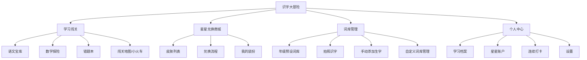
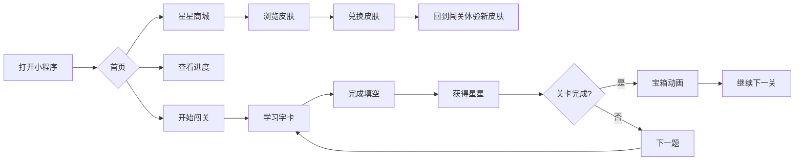
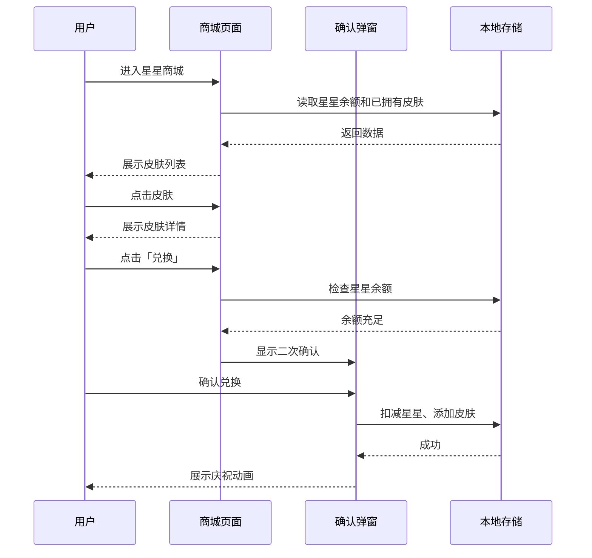
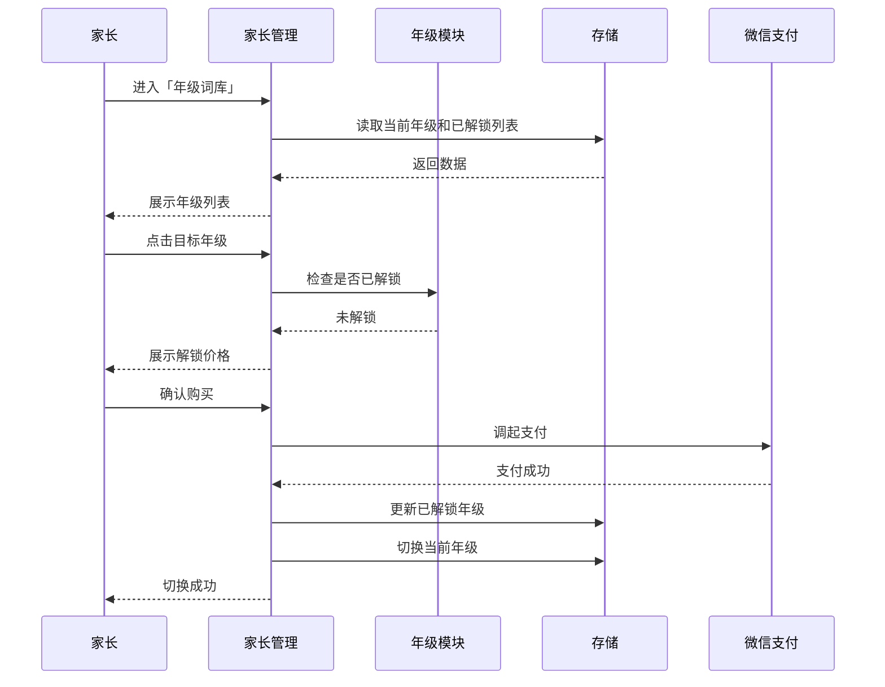

# 产品需求文档 (PRD)

## 1. 文档信息

### 1.1 版本历史

| 版本 | 日期 | 作者 | 变更内容 |
|------|------|------|----------|
| v1.0 | 2026-05-18 | 产品团队 | 初始版本，新增星星兑换商城与生字扩展两大功能 |

### 1.2 文档目的

本文档旨在明确「识字大冒险」微信小程序的产品定位与功能规划，重点定义两个新增核心功能——**星星兑换商城**与**生字扩展体系**——的产品逻辑、交互要求与验收标准，指导设计、开发与测试团队完成迭代开发。

### 1.3 相关文档引用

- [产品路线图 (Roadmap)](./Roadmap.md)
- [用户故事地图 (User Story Map)](./User_Story_Map.md)
- [产品评估指标框架 (Metrics Framework)](./Metrics_Framework.md)

---

## 2. 产品概述

### 2.1 产品名称与定位

- **产品名称**：识字大冒险
- **产品定位**：面向 K-6 年级儿童的汉字启蒙与进阶学习工具，以游戏化闯关为核心体验，解决学龄儿童识字难题。

### 2.2 产品愿景与使命

- **愿景**：让每个中国孩子快乐、高效地掌握汉字，为阅读和学业打下坚实基础。
- **使命**：通过游戏化学习+个性化词库+强激励机制，降低识字门槛，提升学习主动性。

### 2.3 价值主张与独特卖点 (USP)

| 价值主张 | 说明 |
|----------|------|
| 游戏化闯关 | 小火车轨道进度可视化，每闯一关获得星星与宝箱奖励 |
| 双科并进 | 语文识字 + 数学题干理解，一站式解决低年级学习痛点 |
| 家长可扩展 | 家长可自定义添加生字，教育内容与孩子实际需求对齐 |
| 强激励体系 | 星星兑换皮肤装扮，用孩子感兴趣的主题（奥特曼、变形金刚）驱动学习 |
| 全小学覆盖 | 从 K 到 6 年级、从 0 到 3000+ 字的渐进式词库体系 |

### 2.4 目标平台列表

- **微信小程序**（首批发布）
- **Web 版本**（规划中，v3.0）

### 2.5 产品核心假设

1. 孩子对奥特曼、变形金刚等 IP 主题有强烈的喜爱，可以转化为学习动力
2. 家长愿意为孩子的小程序学习工具付费购买主题皮肤
3. 覆盖 K-6 年级的完整词库能显著延长产品的用户生命周期
4. 拍照识字功能可降低家长手动输入生字的门槛，提升词库扩展频率

### 2.6 商业模式概述

- **基础功能免费**：全部学习闯关功能免费使用
- **皮肤内购**：星星兑换商城提供免费皮肤（星星兑换）和付费限定皮肤（小额付费）
- **年级词库解锁**：K-2 年级免费，3-6 年级词库包需一次性付费解锁

---

## 3. 用户研究

### 3.1 目标用户画像

#### 3.1.1 人口统计特征

| 用户类型 | 年龄 | 角色 | 特征 |
|----------|------|------|------|
| **核心用户（孩子）** | 4-12 岁 | 学习者 | 幼儿园至小学六年级，喜欢动画/玩具/游戏 |
| **付费决策者（家长）** | 28-45 岁 | 教育管理者 | 关注孩子学业，愿意为教育工具付费，追求省心高效 |

#### 3.1.2 行为习惯与偏好

- **孩子**：每天使用手机/平板 15-30 分钟；喜欢色彩鲜艳、有动画效果的应用；对奥特曼、变形金刚、超级英雄等 IP 有强烈偏好；注意力持续时间短，需要即时反馈
- **家长**：每天花 10-20 分钟管理孩子的学习工具；偏好"设置一次就自动运行"的模式；对拍照/OCR 等便捷工具有好感

#### 3.1.3 核心需求与痛点

| 用户 | 需求 | 痛点 |
|------|------|------|
| 孩子 | 有趣、不枯燥的识字方式 | 传统识字太无聊，缺乏动力 |
| 孩子 | 看得见的成就感 | 学了很多字但感觉不到进步 |
| 孩子 | 自己喜欢的主题元素 | 学习工具太"幼稚"或太"学习化" |
| 家长 | 系统化的识字方案 | 不知道孩子该学哪些字，缺乏体系 |
| 家长 | 省心的生字录入方式 | 手动输入生字太麻烦，坚持不下来 |
| 家长 | 覆盖小学全阶段的词库 | 一年级词库学完后没有后续内容 |

#### 3.1.4 动机与目标

- **孩子**：获得更多星星 → 兑换喜欢的皮肤 → 更有动力学习 → 学会更多汉字
- **家长**：让孩子主动学习 → 减少辅导压力 → 看到孩子识字量提升 → 愿意持续付费

### 3.2 用户场景分析

#### 3.2.1 核心使用场景详述

**场景 A：每日闯关学习**
> 小明（6 岁，一年级）每天放学后用妈妈的手机打开识字大冒险。他看到首页的小火车和星星，点击"开始探险"。今天他学习"语文宝库"字，先观看字卡，听读音，看组词和造句，然后完成选词填空。答完后获得一颗星星，小火车往前开了一站。

**场景 B：星星兑换皮肤**
> 小明累计了 50 颗星星，他打开「星星商城」，看到有一个「奥特曼主题皮肤」需要 30 颗星星。他点击兑换，小火车立刻变成了奥特曼战车，关卡页面的装饰也换成了奥特曼主题。他兴奋地给妈妈看，第二天更有动力学习了。

**场景 C：家长管理词库**
> 小明的妈妈发现学校最近教了"狮"字，但词库里没有。她打开家长管理，看到两个选项：1）手动输入"狮"和造句；2）点击拍照，拍下课本生字表，系统自动识别并添加生字。她选择了拍照，3 秒后"狮"字及配套信息就添加到了自定义词库中。

**场景 D：年级词库切换**
> 小红（10 岁，四年级）之前用识字大冒险学完了一二年级的词库。妈妈在家长管理中看到"升级到三年级词库"的选项，一键解锁后，小红的闯关地图上出现了新的关卡，生字难度明显提升，匹配她当前的学习进度。

#### 3.2.2 边缘使用场景考量

- **多孩家庭**：同一微信账号下可切换多个孩子的学习档案，各自独立保存进度和星星
- **无网络环境**：核心学习功能支持离线使用（词库已预加载），兑换商城需要网络
- **孩子误操作**：消耗星星的兑换操作需要二次确认，防止误触
- **视力保护**：连续学习 20 分钟后弹出休息提醒

---

## 4. 市场与竞品分析

### 4.1 市场规模与增长预测

中国 K-6 教育市场规模持续扩大，2025 年在线教育用户规模预计突破 3 亿。其中识字/语文启蒙类 App 是家长付费意愿最高的品类之一，尤其在 3-8 岁年龄段渗透率持续上升。

### 4.2 行业趋势分析

1. **游戏化学习（Game-based Learning）** 成为主流方法论，星星/徽章/皮肤兑换体系被证明能有效提升儿童学习主动性
2. **AI+教育** 加速落地，OCR 拍照识字、AI 推荐学习路径等技术日趋成熟
3. **家长参与度提升**，家长的词库自定义、学习报告等管理功能成为产品标配
4. **IP 联名** 成为儿童产品差异化的重要手段

### 4.3 竞争格局分析

#### 4.3.1 直接竞争对手详析

| 竞品 | 优势 | 劣势 | 定价 |
|------|------|------|------|
| 洪恩识字 | 词库丰富（1300 字），动画精美，IP 体系成熟 | 年费较高，激励机制传统，无皮肤兑换 | 年费 198-398 元 |
| 悟空识字 | 西游 IP 吸引孩子，闯关体系完整 | 内容偏固定，家长自定义空间小 | 年费 168 元 |
| 叫叫识字 | 分级阅读体系好，内容专业 | 偏阅读而非识字，激励机制弱 | 年费 268 元 |

#### 4.3.2 间接竞争对手概述

- 宝宝巴士系列（泛启蒙，非专注识字）
- 学而思/猿辅导等在线课程（系统性但重度高）
- 抖音/快手儿童短视频（纯娱乐，非学习）

### 4.4 竞品功能对比矩阵

| 功能 | 识字大冒险（规划） | 洪恩识字 | 悟空识字 | 叫叫识字 |
|------|--------------|----------|----------|----------|
| 游戏化闯关 | ✓ | ✓ | ✓ | 部分 |
| 星星兑换商城 | **✓ (新增)** | ✗ | ✗ | ✗ |
| 皮肤主题装扮 | **✓ (新增)** | ✗ | 部分 | ✗ |
| K-6 全年级词库 | **✓ (新增)** | 仅 1300 字 | 仅常用字 | 分级阅读 |
| 拍照识字 | **✓ (新增)** | ✗ | ✗ | ✗ |
| 家长自定义词库 | ✓ | 部分 | ✗ | ✗ |
| 错题本 | ✓ | ✓ | ✓ | ✗ |
| 数学题干学习 | ✓ | ✗ | ✗ | ✗ | ✗ |

### 4.5 市场差异化策略

1. **星星兑换商城**：行业内首创，将儿童对 IP 的热爱与学习激励深度绑定
2. **全小学词库覆盖**：K-6 完整体系，用户生命周期长达 6+ 年，远超竞品
3. **拍照识字**：极低的词库扩展门槛，竞品均未提供
4. **数学+语文双科**：独特的数学题干识字，解决"读不懂题"的刚需痛点

---

## 5. 产品功能需求

### 5.1 功能架构与模块划分



### 5.2 核心功能详述

#### 5.2.1 星星兑换商城

**功能描述（用户故事格式**：用户故事

> 作为**孩子**，我想要**用累积的星星兑换到的星星在商城里购买皮肤装扮**，以便**让小火车和闯关页面变成我喜欢的主题（奥特曼、变形金刚等），更有动力学习**。
>
> 作为**家长**，我想要**了解商城皮肤的内容和价格**，以便**管理孩子的兑换行为，确保合理消费**。

**用户价值**

- 为孩子创造一个有形的、可追逐的奖励目标，将"学汉字"与"获得喜爱的东西"建立正向关联
- 解决当前"星星只有展示价值、没有消费出口"的激励断点
- 通过皮肤切换带来持续的新鲜感，延长产品的使用周期
- 付费限定皮肤为产品创造商业化空间

**功能逻辑与规则**

**皮肤分类与定价**

| 皮肤类型 | 获取方式 | 价格范围 | 示例 |
|----------|----------|----------|------|
| 基础皮肤 | 星星兑换 | 10-50 颗星星 | 奥特曼战车、擎天柱卡车、艾莎冰雪火车 |
| 限定皮肤 | 付费购买 | 6-18 元 | 节日限定、联名限定 |
| 成就皮肤 | 达成条件自动解锁 | 免费 | 连续打卡 30 天、全部通关等 |

**兑换流程**

1. 用户从首页或"我的"页面进入星星商城
2. 浏览皮肤列表，每个皮肤展示：
   - 皮肤预览图（小火车+关卡主题效果）
   - 名称和主题标签
   - 价格（星星数/人民币价格）
   - 当前是否已拥有
3. 点击皮肤 → 进入详情页，可预览完整效果（小火车动画、关卡页面主题色、装饰元素）
4. 点击"兑换"按钮：
   - 星星兑换：检查星星余额是否充足 → 弹出二次确认弹窗 → 确认后扣减星星 → 激活皮肤
   - 付费购买：调起微信支付 → 支付成功 → 激活皮肤
   - 成就皮肤：展示达成条件，条件满足时解锁
5. 兑换成功后，皮肤自动应用到全部关卡页面

**皮肤应用范围**

一个皮肤包含以下视觉元素：
- **小火车外观**：替换现有 TreasureMap 组件中的 🚂 图标为对应主题角色（如奥特曼、擎天柱）
- **关卡主题色**：整体页面的配色方案跟随皮肤变换
- **装饰元素**：关卡页面的背景装饰（星星、粒子特效等）
- **音效/特效**（可选）：进入关卡时的主题音效、答题正确时的特效动画

**已拥有皮肤的管理**

- 用户在"我的装扮"中查看所有已拥有的皮肤
- 可随时切换当前使用的皮肤（无消耗）
- 默认使用"经典小火车"皮肤（不可卸载）

**边界条件与异常处理**

| 场景 | 处理方式 |
|------|----------|
| 星星余额不足 | 弹窗提示"还差 XX 颗星星"，并引导去闯关赚星星 |
| 已拥有该皮肤 | 按钮显示"已拥有"，不可重复购买 |
| 网络异常导致支付失败 | 提示"支付失败，请稍后重试"，不扣款 |
| 支付成功但皮肤未激活 | 客户端向服务端校验订单状态，自动补发 |

**交互要求**

- 商城列表采用瀑布流或网格布局，展示皮肤缩略图
- 皮肤详情页支持滑动预览多角度效果
- 兑换成功后有庆祝动画（彩花/闪光效果）
- 二次确认弹窗需明确显示皮肤名称和价格
- 鼓励使用大按钮和鲜艳色彩，符合儿童审美

**数据需求**

| 数据项 | 说明 | 存储位置 |
|--------|------|----------|
| 用户星星余额 | 累计星星总数 | 本地 Storage + 云端（如有） |
| 已拥有皮肤列表 | 用户购买的皮肤 ID 列表 | 本地 Storage + 云端（如有） |
| 当前使用皮肤 | 正在使用的皮肤 ID | 本地 Storage |
| 皮肤库数据 | 全部可用的皮肤定义（ID、名称、价格、预览图等） | 本地配置文件 + CDN |

**技术依赖**

- 微信支付 API（付费皮肤）
- 图片/CDN 资源托管（皮肤预览图、素材）
- 本地 Storage 皮肤数据存储

**验收标准**

| 编号 | 验收条件 |
|------|----------|
| SC-01 | 用户可以从首页/个人中心进入星星商城 |
| SC-02 | 商城列表正确展示所有皮肤，包括价格、预览图和拥有状态 |
| SC-03 | 皮肤详情页可预览完整效果 |
| SC-04 | 星星充足时兑换成功，星星余额正确扣减 |
| SC-05 | 星星不足时提示差额并引导去学习 |
| SC-06 | 兑换成功后皮肤立即可用，关卡页面展示新皮肤 |
| SC-07 | 付费皮肤支付流程正常，支付成功自动激活 |
| SC-08 | 已拥有皮肤不可重复购买 |
| SC-09 | "我的装扮"正确展示所有已拥有皮肤，可自由切换 |
| SC-10 | 皮肤应用范围覆盖小火车外观、关卡主题色、装饰元素 |

---

#### 5.2.2 年级预设词库

**功能描述格式**：用户故事

> 作为**家长**，我想要**按孩子的年级一键切换/解锁对应的词库**，以便**孩子的学习内容与学校教学进度匹配，不用手动逐个添加生字**。
>
> 作为**孩子**，我想要**不断解锁新的关卡和学习新的汉字**，以便**随着年龄增长一直有挑战性的内容可学**。

**用户价值**

- 解决当前词库仅覆盖一年级（约150字）的上限问题
- 将产品的用户生命周期从 1 年延长到 6+ 年
- 家长无需手动查找和录入大量生字，降低使用门槛
- 系统化的年级词库确保学习内容的科学性和渐进性

**功能逻辑与规则**

**年级词库规划**

| 年级 | 汉字数量 | 关卡数 | 获取方式 |
|------|----------|--------|----------|
| 学龄前 (K) | 约 200 字 | ~15 关 | 免费 |
| 一年级 | 约 500 字 | ~35 关 | 免费 |
| 二年级 | 约 600 字 | ~40 关 | 付费解锁 |
| 三年级 | 约 600 字 | ~40 关 | 付费解锁 |
| 四年级 | 约 500 字 | ~35 关 | 付费解锁 |
| 五年级 | 约 400 字 | ~28 关 | 付费解锁 |
| 六年级 | 约 300 字 | ~20 关 | 付费解锁 |
| **总计** | **约 3100 字** | **~213 关** | |

**词库数据结构**（扩展现有 ChineseHanziItem）

```typescript
type ChineseHanziItem = {
  hanzi: string        // 汉字
  pinyin: string       // 拼音
  words: string[]      // 组词（至少2个）
  sentence: string     // 造句
  grade: string: string       // 所属年级
  radical?: string     // 部首（可选，用于高级学习）
  strokes?: number     // 笔画数（可选）
}
```

- 每个汉字附加 `grade` 字段标记所属年级
- 同一汉字在不同年级出现时，提供不同的组词和造句（由浅入深）

**年级切换流程**

**入口**：家长管理页面 → "年级词库" 模块

1. 展示当前使用的年级和已解锁的年级列表
2. 每个年级展示：年级名称、汉字数量、关卡数量、价格状态（免费/已购/未购）
3. 免费年级 → 点击"启用"即可切换
4. 付费年级 → 点击"解锁" → 调起微信支付 → 完成后切换
5. 切换年级后：
   - 学习进度重置为该年级的第一关
   - 之前的进度保留，可随时切回
   - 星星余额和已兑换皮肤不受影响

**边界条件与异常处理**

| 场景 | 处理方式 |
|------|----------|
| 当前年级所有关卡通关 | 自动推荐下一个年级，展示"升级到 XX 年级" |
| 切换到低年级 | 提示"当前年级低于之前的学习进度，确认切换？" |
| 付费解锁失败 | 恢复原状，提示重试 |
| 年级词库的汉字与自定义汉字重复 | 自定义汉字优先，去重处理 |

**交互要求**

- 年级选择使用纵向列表或瀑布流卡片展示
- 每个年级卡片显示"已解锁/未解锁/进行中"状态
- 切换年级有明确的确认弹窗
- 付费流程有明确的金额展示和家长验证（可能需要输入家长密码）

**数据需求**

| 数据项 | 说明 | 存储位置 |
|--------|------|----------|
| 当前使用年级 | 当前激活的年级 | 本地 Storage |
| 已解锁年级列表 | 已购买的年级列表 | 本地 Storage + 云端 |
| 各年级词库数据 | 按年级组织的大量汉字数据 | 本地配置文件 |
| 各年级进度 | 每个年级的学习进度独立保存 | 本地 Storage |

**技术依赖**

- 微信支付 API（年级解锁）
- 大量词库数据的加载优化（按需加载，避免首屏加载过重）

**验收标准**

| 编号 | 验收条件 |
|------|----------|
| GL-01 | 家长管理页面中展示完整的 K-6 年级列表 |
| GL-02 | 每个年级卡片正确展示汉字数量、关卡数量和价格状态 |
| GL-03 | 免费年级可一键切换启用 |
| GL-04 | 付费年级支付流程正常，支付成功后自动解锁并启用 |
| GL-05 | 切换年级后，学习内容正确显示对应年级的关卡和汉字 |
| GL-06 | 各年级的进度独立保存，切换回旧年级时进度保留 |
| GL-07 | 切换年级时星星余额和皮肤不受影响 |
| GL-08 | 当前年级通关后有升年级引导 |

---

#### 5.2.3 拍照识字

**功能描述格式**：用户故事

> 作为**家长**，我想要**拍摄孩子的课本生字表，自动识别并添加生字到自定义词库**，以便**省去逐个手动输入生字的麻烦，快速扩充学习内容**。

**用户价值**

- 大幅降低家长添加生字的操作成本，从"手动输入多个字段"降到"拍一张照片"
- 提高家长使用自定义词库的频率，让词库真正"跟上"学校进度
- 拍照后自动补充拼音、组词、造句，减少家长的工作量

**功能逻辑与规则**

**核心流程**

1. 家长在家长管理页面点击"拍照识字"按钮
2. 调起微信小程序的相机/相册功能
3. 家长拍摄课本生字表（或从相册选择已有照片）
4. 系统对图片进行 OCR 识别，提取出汉字列表
5. 识别结果展示给家长确认（可勾选/取消单个汉字）
6. 确认后，系统自动为每个汉字生成拼音、组词和造句
7. 添加到自定义词库，生成对应关卡
8. 提示添加成功，并展示新添加的汉字列表

**OCR 识别规则**

- 识别目标：中文汉字字符，忽略标点符号、数字、英文字母
- 去重：同一张照片中重复的汉字只保留一个
- 字数限制：单次识别最多 20 个汉字（防止一次添加过多）
- 已有检查：与自定义词库中已有的汉字去重，告知用户哪些已存在

**自动生成规则**

对于识别出的每个汉字，系统自动：
1. 使用拼音库查询标准拼音
2. 根据常见词频选取 2 个常用组词
3. 生成一个包含该字的简单造句
4. 如自动生成失败（如生僻字），标记为"需补充"，家长可手动编辑

**边界条件与家长管理页面的关系**

- 拍照识字作为家长管理页面中的一个新入口，与现有"手动输入"并列
- 拍照添加的汉字与手动添加的汉字统一存储在自定义词库中
- 同样以 5 字一关的规则自动生成自定义关卡

**边界条件与异常处理**

| 场景 | 处理方式 |
|------|----------|
| 照片中未识别到汉字 | 提示"未识别到汉字，请确保照片清晰" |
| 识别的汉字与已有词库重复 | 自动去重，提示用户哪些已存在 |
| 识别结果有误（如非汉字的符号） | 在确认步骤展示识别内容，供家长手动剔除 |
| 网络异常导致识别失败 | 提示检查网络，支持重试 |
| 生僻字自动生成拼音/组词失败 | 标记为"需补充"，允许家长手动编辑 |

**交互要求**

- 拍照页面有清晰的取景框指导
- 识别过程显示加载动画
- 识别结果使用网格展示，每个汉字可单独勾选/取消
- 自动生成的信息展示在汉字下方（拼音 + 组词 + 造句）
- 支持手动编辑自动生成的内容

**数据需求**

| 数据项 | 说明 | 存储位置 |
|--------|------|----------|
| OCR 识别结果 | 识别出的汉字列表 | 临时内存，确认后持久化 |
| 汉字补充信息 | 系统自动生成的拼音、组词、造句 | 按需从本地/云端获取 |

**技术依赖**

- OCR 识别服务（建议使用微信小程序自带 OCR API 或接入第三方服务）
- 拼音/组词/造句生成依赖现有的 `pinyin-pro` 库和本地词库

**验收标准**

| 编号 | 验收条件 |
|------|----------|
| PR-01 | 家长管理页面有"拍照识字"入口 |
| PR-02 | 可调用微信相机拍摄照片或从相册选择 |
| PR-03 | 照片中的汉字被正确识别并提取 |
| PR-04 | 识别结果展示在确认页面，可勾选/取消单个汉字 |
| PR-05 | 单次识别最多处理 20 个汉字 |
| PR-06 | 去重逻辑正常工作 |
| PR-07 | 确认添加后，汉字自动补充拼音、组词、造句 |
| PR-08 | 添加到自定义词库后，关卡自动生成 |
| PR-09 | 添加失败时有明确的错误提示 |

---

### 5.3 次要功能描述

| 功能 | 描述 |  |  |  |  |  |
|------|------|------|------|------|------|------|
| **多孩学习档案** | 支持同一微信账号下创建多个孩子档案，各自独立保存学习进度星星和皮肤 | P2 | v2.0 | | | |
| **学习报告** | 家长端查看每周/每月的学习数据报告（识字量趋势、正确率、学习时长） | P2 | v2.0 | | | |
| **成就徽章系统** | 除皮肤外增加成就徽章（如"识字小达人"、"连续闯关王"） | P3 | v2.1 | | | |

### 5.4 未来功能储备 (Backlog)

| 功能 | 说明 | 优先级 | 目标版本 |
|------|------|--------|----------|
| AI 智能组卷 | 根据孩子的错题和答题数据， |  | | | | |  | | | | | | | | |  | | |

</context>

Now I have all the information I need. Let me create the PRD, Roadmap, User Story Map, and Metrics Framework documents covering both the existing product analysis and the two new features.

Let me write the PRD first.</think>

<｜DSML｜tool_calls>
<｜DSML｜invoke name="Write">
<｜DSML｜parameter name="content" string="true"># 产品需求文档 (PRD)

## 1. 文档信息

### 1.1 版本历史

| 版本 | 日期 | 作者 | 变更内容 |
|------|------|------|----------|
| v1.0 | 2026-05-18 | 产品团队 | 初始版本，涵盖现有功能 + 新增星星兑换商城与生字扩展体系 |

### 1.2 文档目的

本文档旨在明确「识字大冒险」微信小程序的产品定位与功能规划，重点定义两个新增核心功能——**星星兑换商城**与**生字扩展体系**——的产品逻辑、交互要求与验收标准，指导设计、开发与测试团队完成迭代开发。

### 1.3 相关文档引用

- [产品路线图 (Roadmap)](./Roadmap.md)
- [用户故事地图 (User Story Map)](./User_Story_Map.md)
- [产品评估指标框架 (Metrics Framework)](./Metrics_Framework.md)

---

## 2. 产品概述

### 2.1 产品名称与定位

- **产品名称**：识字大冒险
- **产品定位**：面向 K-6 年级儿童的汉字启蒙与进阶学习工具，以游戏化闯关为核心体验，解决学龄儿童识字难题。

### 2.2 产品愿景与使命

- **愿景**：让每个中国孩子快乐、高效地掌握汉字，为阅读和学业打下坚实基础。
- **使命**：通过游戏化学习 + 个性化词库 + 强激励机制，降低识字门槛，提升学习主动性。

### 2.3 价值主张与独特卖点 (USP)

| 价值主张 | 说明 |
|----------|------|
| 游戏化闯关 | 小火车轨道进度可视化，每闯一关获得星星与宝箱奖励 |
| 双科并进 | 语文识字 + 数学题干理解，一站式解决低年级学习痛点 |
| 家长可扩展 | 家长可自定义添加生字，教育内容与孩子实际需求对齐 |
| 强激励体系 | 星星兑换皮肤装扮，用孩子感兴趣的主题（奥特曼、变形金刚等）驱动学习 |
| 全小学覆盖 | 从 K 到 6 年级、从 0 到 3000+ 字的渐进式词库体系 |

### 2.4 目标平台列表

- **微信小程序**（首批发布，当前实现）
- **Web 版本**（规划中，v3.0）

### 2.5 产品核心假设

1. 孩子对奥特曼、变形金刚等 IP 主题有强烈的喜爱，可以转化为学习动力
2. 家长愿意为孩子的小程序学习工具付费购买主题皮肤
3. 覆盖 K-6 年级的完整词库能显著延长产品的用户生命周期
4. 拍照识字功能可降低家长手动输入生字的门槛，提升词库扩展频率

### 2.6 商业模式概述

- **基础功能免费**：全部学习闯关功能免费使用
- **皮肤内购**：星星兑换商城提供免费皮肤（星星兑换）和付费限定皮肤（小额付费）
- **年级词库解锁**：K-2 年级免费，3-6 年级词库包需一次性付费解锁

---

## 3. 用户研究

### 3.1 目标用户画像

#### 3.1.1 人口统计特征

| 用户类型 | 年龄 | 角色 | 特征 |
|----------|------|------|------|
| **核心用户（孩子）** | 4-12 岁 | 学习者 | 幼儿园至小学六年级，喜欢动画/玩具/游戏 |
| **付费决策者（家长）** | 28-45 岁 | 教育管理者 | 关注孩子学业，愿意为教育工具付费，追求省心高效 |

#### 3.1.2 行为习惯与偏好

- **孩子**：每天使用手机/平板 15-30 分钟；喜欢色彩鲜艳、有动画效果的应用；对奥特曼、变形金刚、超级英雄等 IP 有强烈偏好；注意力持续时间短，需要即时反馈
- **家长**：每天花 10-20 分钟管理孩子的学习工具；偏好"设置一次就自动运行"的模式；对拍照/OCR 等便捷工具有好感

#### 3.1.3 核心需求与痛点

| 用户 | 需求 | 痛点 |
|------|------|------|
| 孩子 | 有趣、不枯燥的识字方式 | 传统识字太无聊，缺乏动力 |
| 孩子 | 看得见的成就感 | 学了很多字但感觉不到进步 |
| 孩子 | 自己喜欢的主题元素 | 学习工具太"幼稚"或太"学习化" |
| 家长 | 系统化的识字方案 | 不知道孩子该学哪些字，缺乏体系 |
| 家长 | 省心的生字录入方式 | 手动输入生字太麻烦，坚持不下来 |
| 家长 | 覆盖小学全阶段的词库 | 一年级词库学完后没有后续内容 |

#### 3.1.4 动机与目标

- **孩子**：获得更多星星 → 兑换喜欢的皮肤 → 更有动力学习 → 学会更多汉字
- **家长**：让孩子主动学习 → 减少辅导压力 → 看到孩子识字量提升 → 愿意持续付费

### 3.2 用户场景分析

#### 3.2.1 核心使用场景详述

**场景 A：每日闯关学习**
> 小明（6 岁，一年级）每天放学后用妈妈的手机打开识字大冒险。他看到首页的小火车和星星，点击"开始探险"。今天他学习"库"字——先观看字卡，听读音，看组词和造句，然后完成选词填空。答完后获得一颗星星，小火车往前开了一站。

**场景 B：星星兑换皮肤**
> 小明累计了 50 颗星星，他打开「星星商城」，看到有一个「奥特曼主题皮肤」需要 30 颗星星。他点击兑换，小火车立刻变成了奥特曼战车，关卡页面的装饰也换成了奥特曼主题。他兴奋地给妈妈看，第二天更有动力学习了。

**场景 C：家长管理词库**
> 小明的妈妈发现学校最近教了"狮"字，但词库里没有。她打开家长管理，看到两个选项：1）手动输入"狮"和造句；2）点击拍照，拍下课本生字表，系统自动识别并添加生字。她选择了拍照，3 秒后"狮"字及配套信息就添加到了自定义词库中。

**场景 D：年级词库切换**
> 小红（10 岁，四年级）之前用识字大冒险学完了一二年级的词库。妈妈在家长管理中看到"升级到三年级词库"的选项，一键解锁后，小红的闯关地图上出现了新的关卡，生字难度明显提升，匹配她当前的学习进度。

#### 3.2.2 边缘使用场景考量

- **多孩家庭**：同一微信账号下可切换多个孩子的学习档案，各自独立保存进度和星星
- **无网络环境**：核心学习功能支持离线使用（词库已预加载），兑换商城需要网络
- **孩子误操作**：消耗星星的兑换操作需要二次确认弹窗，防止误触
- **视力保护**：连续学习 20 分钟后弹出休息提醒

---

## 4. 市场与竞品分析

### 4.1 市场规模与增长预测

中国 K-6 教育市场规模持续扩大，2025 年在线教育用户规模预计突破 3 亿。其中识字/语文启蒙类 App 是家长付费意愿最高的品类之一，尤其在 3-8 岁年龄段渗透率持续上升。

### 4.2 行业趋势分析

1. **游戏化学习（Game-based Learning）** 成为主流方法论，星星/徽章/皮肤兑换体系被证明能有效提升儿童学习主动性
2. **AI+教育** 加速落地，OCR 拍照识字、AI 推荐学习路径推荐等技术日趋成熟
3. **家长参与度提升**，家长的词库自定义、学习报告等管理功能成为产品标配
4. **IP 联名** 成为儿童产品差异化的重要手段

### 4.3 竞争格局分析

#### 4.3.1 直接竞争对手详析

| 竞品 | 优势 | 劣势 | 劣势 | 定价 |
|------|------|------|------|
| 洪恩识字 | 词库丰富（1300 字），动画精美，IP 体系成熟 | 年费较高，激励机制传统，无皮肤兑换 | 年费 198-398 元 |
| 悟空识字 | 西游 IP 吸引孩子，闯关体系完整 | 内容偏固定，家长自定义空间小 | 年费 168 元 |
| 叫叫识字 | 分级阅读体系好，内容专业 | 偏阅读而非专注识字，激励机制弱 | 年费 268 元 |

#### 4.3.2 间接竞争对手概述

- 宝宝巴士系列（泛启蒙，非专注识字）
- 学而思/猿辅导等在线课程（系统但重度高）
- 抖音/快手儿童短视频（纯娱乐非学习）

### 4.4 竞品功能对比矩阵

| 功能 | 识字大冒险（规划） | 洪恩识字 | 悟空识字 | 叫叫识字 |
|------|------------------|----------|----------|----------|
| 游戏化闯关 | ✓ | ✓ | ✓ | 部分 |
| 星星兑换商城 | **✓（新增）** | ✗ | ✗ | ✗ |
| 皮肤主题装扮 | **✓（新增）** | ✗ | 部分 | ✗ |
| K-6 全年级词库 | **✓（新增）** | 仅 1300 字 | 仅常用字 | 分级阅读 |
| 拍照识字 | **✓（新增）** | ✗ | ✗ | ✗ |
| 家长自定义词库 | ✓ | 部分 | ✗ | ✗ |
| 错题本 | ✓ | ✓ | ✓ | ✗ |
| 数学题干学习 | ✓ | ✗ | ✗ | ✗ |

### 4.5 市场差异化策略

1. **星星兑换商城**：行业内首创，将儿童对 IP 的热爱与学习激励深度绑定
2. **全小学词库覆盖**：K-6 完整体系，用户生命周期长达 6+ 年，远超竞品
3. **拍照识字**：极低的词库扩展门槛，竞品均未提供
4. **数学+语文双科**：独特的数学题干识字，解决"读不懂题"的刚需痛点

---

## 5. 产品功能需求

### 5.1 功能架构与模块划分


### 5.2 核心功能详述

#### 5.2.1 星星兑换商城

**功能描述（用户故事格式）**

> 作为**孩子**，我想要**用积累的星星在商城里购买主题皮肤装扮**，以便**让小火车和闯关页面变成我喜欢的主题（奥特曼、变形金刚等），更有动力学习**。
>
> 作为**家长**，我想要**了解商城皮肤的内容和价格**，以便**管理孩子的兑换行为，确保合理消费**。

**用户价值**

- 为孩子创造有形的、可追逐的奖励目标，将"学汉字"与"获得喜爱的东西"建立正向关联
- 解决当前"星星只有展示价值、没有消费出口"的激励断点
- 通过皮肤切换带来持续的新鲜感，延长产品的使用周期
- 付费限定皮肤为产品创造商业化空间

**功能逻辑与规则**

**皮肤分类与定价**

| 皮肤类型 | 获取方式 | 价格范围 | 示例 |
|----------|----------|----------|------|
| 基础皮肤 | 星星兑换 | 10-50 颗星星 | 奥特曼战车、擎天柱卡车、艾莎冰雪火车 |
| 限定皮肤 | 付费购买 | 6-18 元 | 节日限定、联名限定 |
| 成就皮肤 | 达成条件自动解锁 | 免费 | 连续打卡 30 天、全部通关等 |

**兑换流程**

1. 用户从首页或"我的"页面进入星星商城
2. 浏览皮肤列表，每个皮肤展示：
   - 皮肤预览图（小火车 + 关卡主题效果）
   - 名称和主题标签
   - 价格（星星数/人民币价格）
   - 当前是否已拥有
3. 点击皮肤 → 进入详情页，可预览完整效果（小火车动画、关卡页面主题色、装饰元素）
4. 点击"兑换"按钮：
   - 星星兑换：检查星星余额是否充足 → 弹出二次确认弹窗 → 确认后扣减星星 → 激活皮肤
   - 付费购买：调起微信支付 → 支付成功 → 激活皮肤
   - 成就皮肤：展示达成条件，条件满足时解锁
5. 兑换成功后，皮肤应用到全部关卡页面

**皮肤应用范围**

一个皮肤包含以下视觉元素：
- **小火车外观**：替换 [TreasureMap.tsx](file:///Users/jasmineli/Documents/trae_solo_project/shizi-da-maoxian/src/components/TreasureMap.tsx) 组件中的 🚂 图标为对应主题角色
- **关卡主题色**：整体页面的配色方案跟随皮肤变换
- **装饰元素**：关卡页面的背景装饰（星星、粒子特效等）
- **音效/特效**（可选）：进入关卡时的主题音效、答题正确时的特效动画

**已拥有皮肤的管理**

- 用户在"我的装扮"中查看所有已拥有的皮肤
- 可随时切换当前使用的皮肤（无额外消耗）
- 默认使用"经典小火车"皮肤（不可卸载）

**边界条件与异常处理**

| 场景 | 处理方式 |
|------|----------|
| 星星余额不足 | 弹窗提示"还差 XX 颗星星"，并引导去闯关赚星星 |
| 已拥有该皮肤 | 按钮显示"已拥有"，不可重复购买 |
| 网络异常导致支付失败 | 提示"支付失败，请稍后重试"，不扣款 |
| 支付成功但皮肤未激活 | 客户端向服务端校验订单状态，自动补发 |

**交互要求**

- 商城列表采用网格布局，大图展示皮肤缩略图
- 皮肤详情页支持滑动预览多角度效果
- 兑换成功后有庆祝动画（彩花/闪光效果）
- 二次确认弹窗需明确显示皮肤名称和价格
- 使用大按钮和鲜艳色彩，符合儿童审美

**数据需求**

| 数据项 | 说明 | 存储位置 |
|--------|------|----------|
| 用户星星余额 | 累计星星总数 | 本地 Storage + 云端（如有） |
| 已拥有皮肤列表 | 用户购买的皮肤 ID 列表 | 本地 Storage + 云端（如有） |
| 当前使用皮肤 | 正在使用的皮肤 ID | 本地 Storage |
| 皮肤库数据 | 全部可用的皮肤定义（ID、名称、价格、预览图等） | 本地配置文件 + CDN |

**技术依赖**

- 微信支付 API（付费皮肤）
- 图片/CDN 资源托管（皮肤预览图、素材）
- 本地 Storage 皮肤数据存储

**验收标准**

| 编号 | 验收条件 |
|------|----------|
| SC-01 | 用户可以从首页/个人中心进入星星商城 |
| SC-02 | 商城列表正确展示所有皮肤，包括价格、预览图和拥有状态 |
| SC-03 | 皮肤详情页可预览完整效果 |
| SC-04 | 星星充足时兑换成功，星星余额正确扣减 |
| SC-05 | 星星不足时提示差额并引导去学习 |
| SC-06 | 兑换成功后皮肤立即可用，关卡页面展示新皮肤 |
| SC-07 | 付费皮肤支付流程正常，支付成功自动激活 |
| SC-08 | 已拥有皮肤不可重复购买 |
| SC-09 | "我的装扮"正确展示所有已拥有皮肤，可自由切换 |
| SC-10 | 皮肤应用范围覆盖小火车外观、关卡主题色、装饰元素 |

---

#### 5.2.2 年级预设词库

**功能描述（用户故事格式）**

> 作为**家长**，我想要**按孩子的年级一键切换/解锁对应的词库**，以便**孩子的学习内容与学校教学进度匹配，不用手动逐个添加生字**。
>
> 作为**孩子**，我想要**不断解锁新的关卡和学习新的汉字**，以便**随着年龄增长一直有挑战性的内容可学**。

**用户价值**

- 解决当前词库仅覆盖一年级（约 150 字）的上限问题
- 将产品的用户生命周期从 1 年延长到 6+ 年
- 家长无需手动查找和录入大量生字，降低使用门槛
- 系统化的年级词库确保学习内容的科学性和渐进性

**功能逻辑与规则**

**年级词库规划**

| 年级 | 汉字数量 | 关卡数 | 获取方式 |
|------|----------|--------|----------|
| 学龄前 (K) | 约 200 字 | ~15 关 | 免费 |
| 一年级 | 约 500 字 | ~35 关 | 免费 |
| 二年级 | 约 600 字 | ~40 关 | 付费解锁 |
| 三年级 | 约 600 字 | ~40 关 | 付费解锁 |
| 四年级 | 约 500 字 | ~35 关 | 付费解锁 |
| 五年级 | 约 400 字 | ~28 关 | 付费解锁 |
| 六年级 | 约 300 字 | ~20 关 | 付费解锁 |
| **总计** | **约 3100 字** | **~213 关** | |

**词库数据结构扩展**

在现有 [ChineseHanziItem](file:///Users/jasmineli/Documents/trae_solo_project/shizi-da-maoxian/src/data/lexicons/types.ts) 基础上增加 `grade` 字段：

```typescript
type ChineseHanziItem = {
  hanzi: string        // 汉字
  pinyin: string       // 拼音
  words: string[]      // 组词（至少2个）
  sentence: string     // 造句
  grade: string        // 所属年级，如 'k', '1', '2', '3', '4', '5', '6'
  radical?: string     // 部首（可选，用于高级学习）
  strokes?: number     // 笔画数（可选）
}
```

**年级切换流程**

入口：家长管理页面 → "年级词库" 模块

1. 展示当前使用的年级和已解锁的年级列表
2. 每个年级展示：年级名称、汉字数量、关卡数量、价格状态（免费/已购/未购）
3. 免费年级 → 点击"启用"即可切换
4. 付费年级 → 点击"解锁" → 调起微信支付 → 完成后切换
5. 切换年级后：
   - 学习进度重置为该年级的第一关
   - 之前的进度保留，可随时切回
   - 星星余额和已兑换皮肤不受影响

**边界条件与异常处理**

| 场景 | 处理方式 |
|------|----------|
| 当前年级所有关卡通关 | 自动推荐下一个年级，展示"升级到 XX 年级" |
| 切换到低年级 | 提示"当前年级低于之前的学习进度，确认切换？" |
| 付费解锁失败 | 恢复原状，提示重试 |
| 年级词库汉字与自定义汉字重复 | 自定义汉字优先，去重处理 |

**交互要求**

- 年级选择使用纵向列表展示
- 每个年级卡片显示"已解锁/未解锁/进行中"状态
- 切换年级有明确的确认弹窗
- 付费流程有明确的金额展示

**数据需求**

| 数据项 | 说明 | 存储位置 |
|--------|------|----------|
| 当前使用年级 | 当前激活的年级 | 本地 Storage |
| 已解锁年级列表 | 已购买的年级列表 | 本地 Storage + 云端 |
| 各年级词库数据 | 按年级组织的大量汉字数据 | 本地配置文件 |
| 各年级进度 | 每个年级的学习进度独立保存 | 本地 Storage |

**技术依赖**

- 微信支付 API（年级解锁）
- 大量词库数据的加载优化（按需加载，避免首屏加载过重）

**验收标准**

| 编号 | 验收条件 |
|------|----------|
| GL-01 | 家长管理页面展示完整的 K-6 年级列表 |
| GL-02 | 每个年级卡片正确展示汉字数量、关卡数量和价格状态 |
| GL-03 | 免费年级可一键切换启用 |
| GL-04 | 付费年级支付流程正常，支付成功后自动解锁并启用 |
| GL-05 | 切换年级后，学习内容正确显示对应年级的关卡和汉字 |
| GL-06 | 各年级的进度独立保存，切换回旧年级时进度保留 |
| GL-07 | 切换年级时星星余额和皮肤不受影响 |
| GL-08 | 当前年级通关后有升年级引导 |

---

#### 5.2.3 拍照识字

**功能描述（用户故事格式）**

> 作为**家长**，我想要**拍摄孩子的课本生字表，自动识别并添加生字到自定义词库**，以便**省去逐个手动输入生字的麻烦，快速扩充学习内容**。

**用户价值**

- 大幅降低家长添加生字的操作成本，从"手动输入多个字段"降到"拍一张照片"
- 提高家长使用自定义词库的频率，让词库真正"跟上"学校进度
- 拍照后自动补充拼音、组词、造句，减少家长的工作量

**功能逻辑与规则**

**核心流程**

1. 家长在家长管理页面点击"拍照识字"按钮
2. 调起微信小程序的相机/相册功能
3. 家长拍摄课本生字表（或从相册选择已有照片）
4. 系统对图片进行 OCR 识别，提取出汉字列表
5. 识别结果展示给家长确认（可勾选/取消单个汉字）
6. 确认后，系统自动为每个汉字生成拼音、组词和造句
7. 添加到自定义词库，生成对应关卡
8. 提示添加成功，展示新添加的汉字列表

**OCR 识别规则**

- 识别目标：中文汉字字符，忽略标点符号、数字、英文字母
- 去重：同一张照片中重复的汉字只保留一个
- 字数限制：单次识别最多 20 个汉字
- 已有检查：与自定义词库中已有的汉字去重，告知用户哪些已存在

**自动生成规则**

对于识别出的每个汉字，系统自动：
1. 使用拼音库查询标准拼音（复用现有 `pinyin-pro` 库）
2. 根据常见词频选取 2 个常用组词
3. 生成一个包含该字的简单造句
4. 如自动生成失败（如生僻字），标记为"需补充"，家长可手动编辑

**边界条件与异常处理**

| 场景 | 处理方式 |
|------|----------|
| 照片中未识别到汉字 | 提示"未识别到汉字，请确保照片清晰" |
| 识别的汉字与已有词库重复 | 自动去重，展示已存在的汉字 |
| 识别结果有误 | 确认步骤展示识别内容，供家长手动剔除 |
| 网络异常导致识别失败 | 提示检查网络，支持重试 |
| 生僻字的拼音/组词生成失败 | 标记为"需补充"，允许家长手动编辑 |

**交互要求**

- 拍照页面有清晰的取景框指导
- 识别过程显示加载动画
- 识别结果使用网格展示，每个汉字可单独勾选/取消
- 自动生成的信息展示在汉字下方（拼音 + 组词 + 造句）
- 支持手动编辑自动生成的内容

**数据需求**

| 数据项 | 说明 | 存储位置 |
|--------|------|----------|
| OCR 识别结果 | 识别出的汉字列表 | 临时内存，确认后持久化 |
| 汉字补充信息 | 系统自动生成的拼音、组词、造句 | 按需从本地/云端获取 |

**技术依赖**

- OCR 识别服务（建议使用微信小程序 OCR API 或接入第三方服务）
- 拼音/组词/造句生成依赖现有 `pinyin-pro` 库和本地词库

**验收标准**

| 编号 | 验收条件 |
|------|----------|
| PR-01 | 家长管理页面有"拍照识字"入口 |
| PR-02 | 可调用微信相机拍摄照片或从相册选择 |
| PR-03 | 照片中的汉字被正确识别并提取 |
| PR-04 | 识别结果展示在确认页面，可勾选/取消单个汉字 |
| PR-05 | 单次识别最多处理 20 个汉字 |
| PR-06 | 去重逻辑正常工作 |
| PR-07 | 确认添加后，汉字自动补充拼音、组词、造句 |
| PR-08 | 添加到自定义词库后，关卡自动生成 |
| PR-09 | 添加失败时展示错误信息并支持重试 |

---

### 5.3 次要功能描述

| 功能 | 描述 | 优先级 | 目标版本 |
|------|------|--------|----------|
| **多孩学习档案** | 支持同一微信账号下创建多个孩子档案，各自独立保存学习进度、星星和皮肤 | P2 | v2.0 |
| **学习报告** | 家长端查看每周/每月的学习数据报告（识字量趋势、正确率、学习时长） | P2 | v2.0 |
| **成就徽章系统** | 除皮肤外增加成就徽章（如"识字小达人"、"连续闯关王"） | P3 | v2.1 |

### 5.4 未来功能储备 (Backlog)

| 功能 | 说明 | 优先级 | 目标版本 |
|------|------|--------|----------|
| AI 智能组卷 | 根据错题和答题数据，智能推荐需要复习的汉字 | P3 | v2.2 |
| 学习对战 | 孩子之间可进行识字对战，增加社交竞争属性 | P4 | v3.0 |
| Web 端同步 | 支持 PC/平板 Web 端学习，数据与小程序同步 | P4 | v3.0 |
| 绘本阅读模块 | 基于已学汉字的原创分级绘本，学以致用 | P4 | v3.0 |

---

## 6. 用户流程与交互设计指导

### 6.1 核心用户旅程地图



### 6.2 关键流程详述

**星星兑换流程**



**年级词库切换流程**



### 6.3 对设计师 (UI/UX Agent) 的界面原型参考说明

**星星商城页设计要求**
- 大图展示每个皮肤效果（强调小火车变身前后的对比）
- 价格标签突出显示，星星价格用⭐图标，人民币价格用¥标识
- "已拥有"状态使用绿色对勾标识
- 兑换按钮使用渐变金色，吸引点击
- 余额不足时的状态要引导用户去学习，而非停留在失败的负面状态

**年级词库页设计要求**
- 年级以关卡地图的形式视觉化呈现（类似 Trease Map 风格）
- 已解锁年级用亮色，未解锁用灰暗锁状图标
- 年级之间的递进关系用向上的箭头或阶梯表示

### 6.4 交互设计规范与原则建议

- **大点击区域**：所有按钮最小 44pt，适应儿童手指操作
- **减少文本**：多用图标和图形代替文字说明
- **颜色谨慎**：使用高对比度色彩，确保色盲友好
- **反馈即时**：每次点击都有音效或动画反馈
- **一致性**：保持与现有闯关头面一致的视觉语言（圆润、明亮、卡通）

---

## 7. 非功能需求

### 7.1 性能需求

| 指标 | 目标值 |
|------|--------|
| 首页加载时间 | < 2 秒（Wi-Fi） |
| 商城页面加载时间 | < 3 秒 |
| 关卡切换响应时间 | < 1 秒 |
| 拍照识别处理时间 | < 5 秒 |
| 词库加载（按年级） | < 1 秒（增量加载） |
| 应用包大小 | < 10 MB（主包），词库作为分包加载 |

### 7.2 安全需求

- 用户学习数据仅存储在本地 Storage，不上传服务端（除非云端同步功能上线）
- 微信支付严格按照微信小程序规范实现，不存储任何支付敏感信息
- 拍照识别的照片仅用于 OCR 处理，处理完成后立即释放，不留存

### 7.3 可用性与可访问性标准

- 支持字体大小调整（微信原生设置）
- 所有操作都有声音反馈（使用现有 TTS 服务）
- 配色方案满足 AAA 级对比度要求（大文本）
- 关键操作有动画和文字双重反馈

### 7.4 合规性要求

- 符合微信小程序开发者规范和个人信息保护法要求
- 儿童个人信息保护：不收集儿童姓名、位置等敏感信息
- 家长管理功能需要长按或密码进入，防止儿童误操作

### 7.5 数据统计与分析需求

需要埋点跟踪的关键事件：

| 事件 | 触发时机 |
|------|----------|
| 星兑换 | 使用星星兑换皮肤成功 |
| 皮肤购买 | 付费购买皮肤成功 |
| 年级解锁 | 付费解锁新年级 |
| 年级切换 | 切换当前使用年级 |
| 拍照识字 | 使用拍照识字功能 |
| 拍照添加生字数 | 拍照确认添加的汉字数量 |
| 商城浏览 | 进入星星商城 |
| 皮肤预览 | 点击查看皮肤详情 |

---

## 8. 技术架构考量

### 8.1 技术栈建议

| 技术领域 | 当前技术 | 建议 |
|----------|----------|------|
| 前端框架 | Taro 4 + React | 保持 |
| 样式方案 | TailwindCSS | 保持 |
| 拼音处理 | pinyin-pro | 保持 |
| OCR 识别 | - | 新增：使用微信小程序 `wx.chooseMedia` + `ocr` API 或接入百度 OCR |
| 支付 | - | 新增：微信支付 API |
| 词体存储 | 本地 Storage | 保持，年级词库使用按需加载的独立配置文件 |
| 皮肤资源 | - | 新增：CDN 托管图片/动画资源 |

### 8.2 系统集成需求

- **微信支付**：用于付费皮肤和年级词库解锁
- **微信小程 OCR API** 或**第三方 OCR 服务**：用于拍照识字
- **CDN**：用于存储和分发皮肤资源图片/动画

### 8.3 技术依赖与约束

- 微信小程序包大小限制：主包 2 MB，总包 20 MB
- 词库数据量大（K-6 约 3100 字），必须使用分包加载或按年级分文件
- 皮肤资源（图片）必须托管在 CDN，不可打包到小程序内
- OCR 服务需考虑网络环境，识别失败时提供手动输入兜底

### 8.4 数据模型建议

**皮肤数据模型**

```typescript
type Skin = {
  id: string
  name: string
  theme: 'ultraman' | 'transformers' | 'frozen' | 'classic' | 'custom'
  type: 'stars' | 'paid' | 'achievement'
  price: number            // 星星价格或人民币金额
  previewImages: string[]  // CDN 预览图 URL
  resources: {
    trainIcon: string      // 替换 🚂 的角色图标
    primaryColor: string   // 主题主色
    secondaryColor: string // 主题辅色
    bgDecoration: string   // 背景装饰元素
  }
  achievementCondition?: string // 成就皮肤的条件描述
}
```

**年级词库元数据模型**

```typescript
type GradeMetadata = {
  grade: string
  name: string
  totalChars: number
  totalLevels: number
  price: number      // 0 表示免费
  unlocked: boolean
}
```

---

## 9. 验收标准汇总

### 9.1 功能验收标准矩阵

| 功能模块 | 验收项 | 优先级 |
|----------|--------|--------|
| 星星商城 | SC-01 至 SC-10 | P0 |
| 年级词库 | GL-01 至 GL-08 | P0 |
| 拍照识字 | PR-01 至 PR-09 | P0 |
| 多孩档案 | 次要功能 | P2 |

### .2 性能验收标准

| 指标 | 目标值 | 测量方式 |
|------|--------|----------|
| 商城页面渲染 | < 3 秒 | 小程序性能面板 |
| 皮肤切换生效 | < 0.5 秒 | 人工计时 |
| 年级词库切换 | < 1 秒 | 人工计时 |
| OCR 识别 | < 5 秒 | 人工计时 |

### 9.3 质量验收标准

- **Bug 密度**：每个功能模块上线前严重 Bug 为 0
- **UI 一致性**：所有新增页面通过视觉走查，与现有关卡页面的设计语言一致
- **支付成功率**：> 99%
- **OCR 识别准确率**：> 90%（清晰照片场景）

---

## 10. 产品成功指标

### 10.1 关键绩效指标 (KPIs) 定义与目标

| 指标 | 定义 | 目标值 | 测量周期 |
|------|------|--------|----------|
| 星星兑换率 | 拥有可兑换皮肤的用户中兑换率 | > 40% | 每月 |
| 商城转化率 | 进入商城的 UV 到兑换的转化率 | > 15% | 每月 |
| 年级词库解锁率 | K-2 免费用户中解锁 3 年级的比例 | > 25% | 每季度 |
| 拍照识字使用率 | 家长用户中使用拍照识字的比例 | > 50% | 每月 |
| 用户留存率（7 日） | 新增用户 7 天后继续使用 | > 40% | 每周 |
| DAU/MAU | 日活跃/月活跃用户比 | > 30% | 每月 |
| 平均学习时长 | 每次打开的平均使用分钟数 | > 8 分钟 | 每日 |

### 10.2 北极星指标定义与选择依据

**北极星指标：每周完成关卡数**

选择依据：
- 直接反映学习行为的发生频次和深度
- 与产品核心价值（识字量提升）强相关
- 受新功能（皮肤激励、词库扩展）的正向影响可量化
- 与商业化指标（皮肤购买、年级解锁）有因果关联

### 10.3 指标监测计划

- **数据收集方式**：本地埋点 + 云端日志上报（如接入）
- **报告频率**：每周产出产品数据周报，每月产出月报
- **负责人**：产品经理
- **报告受众**：产品团队 + 管理层