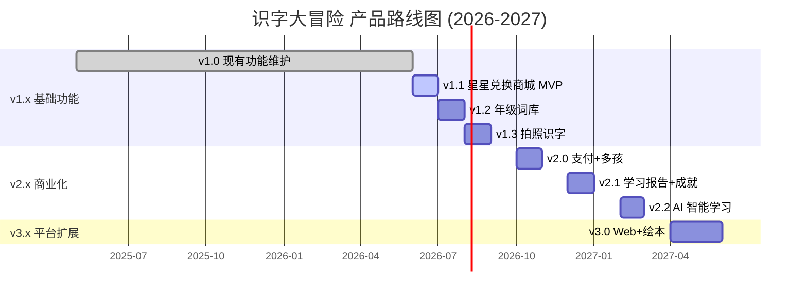

# 产品路线图 (Roadmap)

## 路线图概述

本路线图规划了「识字大冒险」从 v1.0（当前状态）到 v3.0 的版本演进路径，重点围绕星星兑换商城和生字扩展体系两大核心功能进行迭代。

| 版本 | 主题 | 目标上线日期 | 核心交付物 |
|------|------|--------------|------------|
| v1.1 | 星星兑换商城 MVP | 2026-07 | 基础兑换流程 + 3 款免费皮肤 |
| v1.2 | 生字扩展 V1 — 年级词库 | 2026-08 | K-6 年级全词库 + 年级切换/解锁 |
| v1.3 | 生字扩展 V2 — 拍照识字 | 2026-09 | OCR 拍照识别 + 自动补充拼音组词 |
| v2.0 | 商业化与体验升级 | 2026-11 | 付费皮肤 + 付费年级解锁 + 多孩档案 |
| v2.1 | 学习数据与分析 | 2027-01 | 学习报告 + 成就徽章 |
| v1 |
| v2.2 | 智能学习 | 2026-2027 | 2027-03 | AI 智能组卷 + 个性化学习路径 |
| v3.0 | 平台扩展 | 2027-06 | Web 端支持 + 绘本阅读模块 |

---

## 版本规划策略

**版本命名规则**：遵循语义化版本 `vMAJOR.MINOR`

- **MAJOR**：重大里程碑（架构变更、平台扩展、新商业模式）
- **MINOR**：功能迭代（新功能模块、功能增强）

**发布节奏**：每月 1 个 MINOR 版本，每季度评估 MAJOR 版本计划

---

## 详细版本规划

### v1.1 — 星星兑换商城 MVP (2026-07)

**目标**：跑通星星兑换的完整流程，验证"皮肤激励 → 学习主动提升"的核心假设

**交付功能**

| 功能 | 优先级 | 说明 |
|------|--------|------|
| 星星商城首页 | P0 | 网格展示皮肤，分"免费/付费/成就"Tab |
| 皮肤详情页 | P0 | 预览皮肤效果，展示价格 |
| 星星兑换流程 | P0 | 二次确认 → 扣减星星 → 激活皮肤 |
| 我的装扮 | P0 | 查看已拥有皮肤，自由切换 |
| 3 款免费皮肤 | P0 | 奥特曼、变形金刚、艾莎 |
| 皮肤应用系统 | P0 | 替换 TreasureMap 的 🚂 图标 + 主题色 |
| 星星余额不足引导 | P1 | 提示缺口并引导去闯关 |
| 成就皮肤框架 | P2 | 定义条件但不实现具体成就 |

**不包含**：付费购买皮肤、多孩档案、云端同步

**技术依赖**
- 新增 `src/domain/skins.ts` — 皮肤数据管理和存储逻辑
- 修改 [TreasureMap.tsx](file:///Users/jasmineli/Documents/trae_solo_project/shizi-da-maoxian/src/components/TreasureMap.tsx) — 支持动态替换火车图标
- 新增 `src/pages/shop/index.tsx` — 商城页面
- 新增配置 `src/data/skins/index.ts` — 皮肤定义数据
- 皮肤资源托管至 CDN（预览图片）

**持续影响数据**：
- skin 资源需持续迭代（3 款 MVP → 持续新增）
- 用户反馈收集要到位，为 v1.2 优化做准备

---

### v1.2 — 生字扩展 V1：年级词库 (2026-08)

**目标**：完成 K-6 年级全词库的数据整理和加载机制，实现年级切换

**交付功能**

| 功能 | 优先级 | 说明 |
|------|--------|------|
| K-6 词库数据 | P0 | 约 3100 汉字的完整词库，按年级组织 |
| 年级词库管理页面 | P0 | 家长管理中的"年级词库"入口 |
| 年级切换功能 | P0 | 一键切换当前学习年级 |
| 年级进度独立保存 | P0 | 各年级学习进度互相独立 |
| 年级解锁机制 | P0 | 免费年级直接使用 |
| 通关升年级引导 | P1 | 全部通关后推荐下一个年级 |
| 词库按需加载优化 | P0 | 分包加载，首屏只加载当前年级 |
| 汉字 grade 字段扩展 | P0 | [ChineseHanziItem](file:///Users/jasmineli/Documents/trae_solo_project/shizi-da-maoxian/src/data/lexicons/types.ts) 增加 grade 字段 |

**不包含**：付费解锁年级、拍照识字

**技术依赖**
- 扩展 [chinese.ts](file:///Users/jasmineli/Documents/trae_solo_project/shizi-da-maoxian/src/data/lexicons/chinese.ts) — 增加全部年级词库数据
- 修改 [customLexicon.ts](file:///Users/jasmineli/Documents/trae_solo_project/shizi-da-maoxian/src/data/customLexicon.ts) — 增加年级词库逻辑
- 新增 `src/data/lexicons/gradeIndex.ts` — 年级索引
- 更新 [progress.ts](file:///Users/jasmineli/Documents/trae_solo_project/shizi-da-maoxian/src/domain/progress.ts) — 按年级保存进度

**数据准备工作量最大**，3100 个汉字数据的整理需要投入较多资源
可考虑分批次上线：先完成 K-2，再补充 3-6

---

### v1.3 — 生字扩展 V2：拍照识字 (2026-09)

**目标**：实现 OCR 拍照添加生字，大幅降低家长扩展词库的门槛

**交付功能**

| 功能 | 优先级 | 说明 |
|------|--------|------|
| 拍照识字入口 | P0 | 家长管理页面的"拍照识页面按钮 |
| 相机/相册调用 | P0 | 调用微信小程序媒体能力 |
| OCR 识别 | P0 | 识别照片中的汉字 |
| 识别结果确认 | P0 | 展示识别结果，可勾选/取消 |
| 自动补充拼音组词造句 | P0 | 基于识别结果自动生成学习数据 |
| 添加到自定义词库 | P0 | 与现有自定义词库统一存储 |
| 生僻字手动补充 | P1 | 自动生失败时支持手动编辑 |

**不包含**：联网搜索词源、批量导入

**技术依赖**
- 接入 OCR 服务（微信小程序 API 或第三方）
- 复用现有 [customLexicon.ts](file:///Users/jasmineli/Documents/trae_solo_project/shizi-da-maoxian/src/data/customLexicon.ts) 的存储逻辑
- 新增拍照识页面

---

### v2.0 — 商业化与体验升级 (2026-11)

**目标**：实现商业闭环，支持多孩家庭场景

**交付功能**

| 功能 | 优先级 | 说明 |
|------|--------|------|
| 付费皮肤 | P0 | 微信支付购买限定皮肤 |
| 付费年级解锁 | P0 | 支持付费解锁 3-6 年级词库 |
| 多孩学习档案 | P0 | 同一账号下切换多个孩子 |
| 云端同步 v1 | P1 | 学习进度云备份（选配） |
| 家长验证机制 | P0 | 付费操作需要家长密码/指纹验证 |

---

### v2.1 — 学习数据与分析 (2027-01)

**交付功能**

| 功能 | 优先级 | 说明 |
|------|--------|------|
| 学习报告（周/月） | P0 | 识字量、正确率、学习时长趋势 |
| 成就徽章系统 | P1 | 识字小达人、闯关王等成就 |
| 学习提醒 | P2 | 家长可设置每日学习时间提醒 |

---

### v2.2 — 智能学习 (2027-03)

**交付功能**

| 功能 | 优先级 | 说明 |
|------|--------|------|
| AI 智能组卷 | P0 | 根据错题和薄弱环节自动生成练习 |
| 个性化学习路径 | P1 | 根据正确率和速度调整学习节奏 |
| 薄弱字复习 | P1 | 自动将常错的汉字加入复习队列 |

---

### v3.0 — 平台扩展 (2027-06)

**交付功能**

| 功能 | 优先级 | 说明 |
|------|--------|------|
| Web 端上线 | P0 | 支持浏览器访问，使用uni-app或Taro Web |
| 绘本阅读模块 | P0 | 基于已学汉字的原创分级绘本 |
| 数据全平台同步 | P0 | 微信小程序 ↔ Web 数据互通 |

---

## 功能优先级矩阵

| 功能 | 优先级 | 用户价值 | 商业价值 | 实现难度 | 目标版本 |
|------|--------|--------|----------|----------|----------|----------|
| 星星兑换基础流程 | **P0** | 极高 | 中 | 低 | v1.1 |
| 3 款免费皮肤 | **P0** | 极高 | 中 | 低 | v1.1 |
| K-6 年级词库 | **P0** | 极高 | 极高 | 高 | v1.2 |
| 年级切换与进度保存 | **P0** | 极高 | 高 | 中 | v1.2 |
| 拍照识字 | **P0** | 高 | 中 | 中 | v1.3 |
| 付费皮肤 | P1 | 高 | 极高 | 中 | v2.0 |
| 付费年级解锁 | P1 | 高 | 极高 | 中 | v2.0 |
| 多孩档案 | P1 | 高 | 中 | 中 | v2.0 |
| 学习报告 | P2 | 中 | 中 | 中 | v2.1 |
| 成就徽章 | P2 | 中 | 低 | 低 | v2.1 |
| AI 智能组卷 | P2 | 高 | 高 | 高 | v2.2 |

---

## 详细时间线计划（里程碑）

---

## 资源规划（初步建议）

| 角色 | v1.1 阶段 | v1.2 阶段 | v1.3 阶段 | v2.0 阶段 |
|------|-----------|-----------|-----------|-----------|
| 前端开发 | 1 1 | 1 人 | -（专注词库数据）| 1 人 | 1 人 |
| 前端开发 | data="1 人"- |
| 前端开发 | 拍照识别 |1-|
| 后端开发 | -（纯本地） | -（纯本地） | -（纯本地） | 1 人（支付+云端） |
| 设计师 | 1 人（皮肤设计 + 商城UI） | 0.5 人 | - | 1 人 |
| 词库编辑 | - | 2 人（词库数据整理录入） | - | - |
| 产品经理 | 1 人 | 0.5 人 | 0.5 人 | 1 人 |

**v1.2 阶段是资源投入高峰**，3100 个汉字的词库整理需要额外的词库编辑人力

---

## 风险管理

| 风险 | 影响评估 | 描述 | 概率 | 影响 | 应对措施 |
|----------|------|------|------|----------|
| 词库数据整理工作量超预期 | 3100 汉字的组词造句录入非常耗时 | 高 | 高 | 1）分 K-2 / 3-6 两批上线；2）使用 AI 辅助生成后人工审核 |
| OCR 识别准确率不达标 | 课本照片质量参差不齐导致识别率低 | 中 | 中 | 1）接入多家 OCR 对比选优；2）拍照时提供取框引导；3）手工编辑兜底 |
| 皮肤 IP 版权风险 | 奥特曼、变形金刚等 IP 未经授权 | 高 | 高 | 1）MVP 使用自创主题替代（如机甲勇士、冰雪公主）；2）IP 联名作为 v2.0 规划 |
| 微信小程序审核失败 | 涉及支付和虚拟商品购买的审核 | 中 | 高 | 1）严格按照微信小程序虚拟商品支付通过服务商模式；2）提前阅读审核条款做好合规 |
| 孩子沉迷风险 | 皮肤激励导致过度使用 | 低 | 中 | 1）家长可设置每日使用时长上限；2）20 分钟休息提醒 |
| 用户留存不及预期 | 皮肤兑换后新鲜感消退 | 中 | 高 | 1）持续新增皮肤内容；2）引入成就系统增加长期目标；3）提供限时皮肤保持新鲜感 |