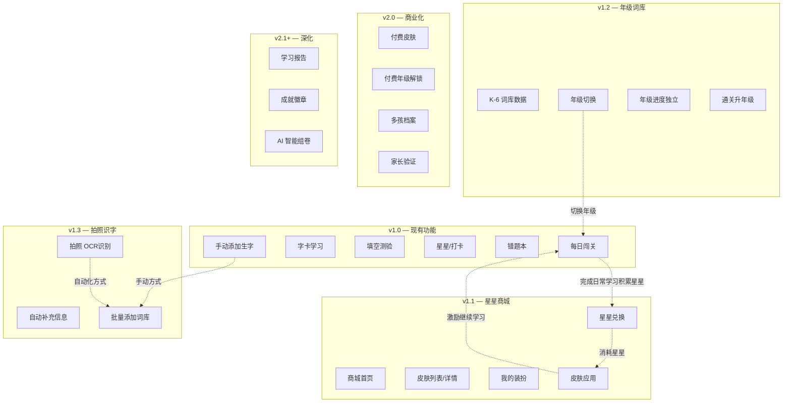

# 用户故事地图 (User Story Map)

## 用户故事地图概述

本文档通过用户故事地图的形式，系统梳理「识字大冒险」的用户活动、任务分解和故事优先级，确保团队对用户需求有统一的理解，并与 Roadmap 版本规划保持一致。

---

## 用户活动与任务分解

### 学生学习旅程

| 用户活动 | 用户任务 | 故事描述 | 优先级 | 版本 |
|----------|----------|----------|--------|------|
| **每日闯关** | 打开小程序 | 作为孩子，我想要打开小程序就看到今天的进度和欢迎语 | P0 | v1.0 |
| | 开始闯关 | 作为孩子，我想要点击"开始探险"按钮进入学习 | P0 | v1.0 |
| | 学习字卡 | 我想要看到汉字的字形、拼音、组词和造句，还能听读音 | P0 | v1.0 |
| | 完成填空测验 | 我想要通过选词填空来检验自己是否学会了 | P0 | v1.0 |
| | 获得星星 | 我想要答对后得到星星奖励，看到进步反馈 | P0 | v1.0 |
| | 通关宝箱 | 我想要完成一关后看到宝箱动画，获得成就感 | P0 | v1.0 |
| | 查看关卡进度 | 我想要在小火车地图上看到自己走到了哪一站 | P0 | v1.0 |
| **星星兑换** | 进入星星商城 | 作为孩子，我想要从首页进入星星商城看到所有皮肤 | P0 | v1.1 |
| | 浏览皮肤列表 | 我想要浏览各种主题的皮肤，看到它们的预览效果 | P0 | v1.1 |
| | 查看皮肤详情 | 我想要点击一个皮肤看到完整的预览动画和价格 | P0 | v1.1 |
| | 兑换星星皮肤 | 我想要消耗星星兑换喜欢的皮肤 | P0 | v1.1 |
| | 查看我的装扮 | 我想要在"我的装扮"中看到所有已拥有的皮肤 | P0 | v1.1 |
| | 切换皮肤 | 我想要自由切换当前使用的皮肤 | P0 | v1.1 |
| | 体验新皮肤 | 我想要在闯关页面看到新皮肤效果（小火车变了，颜色变了） | P0 | v1.1 |
| **个人管理** | 查看累计星星 | 作为孩子，我想要在"我的"页面看到自己一共得了多少星星 | P0 | v1.0 |
| | 查看打卡天数 | 我想要看到自己连续打卡了多少天 | P0 | v1.0 |
| | 复习错题 | 我想要在错题本中复习之前答错的字 | P0 | v1.0 |

### 家长管理旅程

| 用户活动 | 用户任务 | 故事描述 | 优先级 | 版本 |
|----------|----------|----------|--------|------|
| **词库管理** | 手动添加生字 | 作为家长，我想要手动输入生字和造句来扩展词库 | P0 | v1.0 |
| | 拍照添加生字 | 我想要拍照识别课本生字表，快速添加生字 | P0 | v1.3 |
| | 管理自定义词库 | 我想要查看和删除已添加的自定义生字 | P0 | v1.0 |
| **年级管理** | 查看年级列表 | 作为家长，我想要看到 K-6 所有年级的词库信息 | P0 | v1.2 |
| | 切换学习年级我想要一键切换孩子当前的学习年级 | P0 | v1.2 |
| | 解锁付费年级 | 我想为孩子解锁付费年级词库 | P1 | v2.0 |
| | 查看各年级进度 | 我想要看到孩子在每个年级的学习进度 | P1 | v2.0 |P2 | v2.1 |
| **消费管理** | 查看兑换记录 | 作为家长，我想要查看孩子的星星兑换记录 | P1 | v2.0 |
| | 设置消费限制 | 我想要设置孩子每日/每周的最大消费限额 | P2 | v2.0 |
| | 验证家长身份 | 我想要在付费操作时验证身份（密码/指纹） | P0 | v2.0 |
| **学习管理** | 查看学习报告 | 作为家长，我想要查看孩子的学习数据报告 | P2 | v2.1 |
| | 设置学习提醒 | 我想要设置每日学习时间提醒 | P2 | v2.1 |

---

## 故事优先级与版本映射

---

## 用户故事验收标准摘要

| 故事 ID | 故事 | 验收标准 |
|---------|------|----------|
| US-01 | 星星兑换 | 1）进入商城；2）浏览皮肤；3）点击兑换；4）二次确认；5）扣减星星；6）皮肤激活；7）关卡展示新皮肤 |
| US-02 | 皮肤切换 | 1）进入"我的装扮"；2）选择皮肤；3）切换到目标皮肤；4）关卡页面生效 |
| US-03 | 年级切换 | 1）进入家长管理；2）选择年级；3）确认切换；4）学习内容更新为该年级 |
| US-04 | 拍照识字 | 1）进入拍照识字；2）拍摄照片；3）查看识别结果；4）勾选确认；5）添加成功 |
| US-05 | 付费购买 | 1）选择付费商品；2）家长验证；3）微信支付；4）支付成功；5）商品激活 |